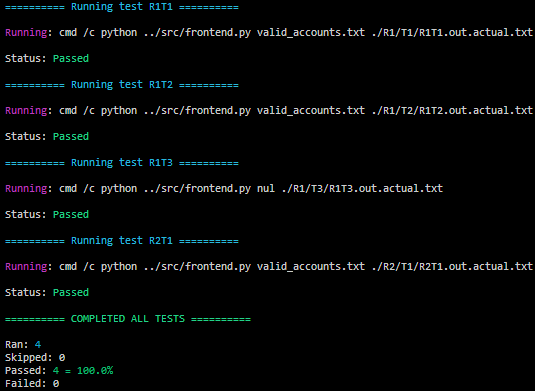
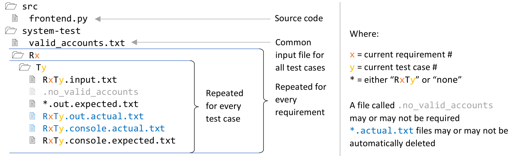

# CMPE 327
Code for CISC/CMPE 327 Software Quality Assurance Course

## Custom system testing script
This project shows how to preform system testing of a python script without using `pytest`

The [system_test_runner.py](system-test/system_test_runner.py) script is designed for the ELEC 327 frontend system testing assignment and handles lots of special cases that might be useful for the different test cases required.

## Getting started:

### Installation:

1. Download/clone this repository
2. In root folder, run: 

        pip install -r requirements.txt

### Basic usage: 
In root folder, run:
- Windows: 

        system-test-frontend.bat

- Cross-platform: 

        cd system-test
        python system_test_runner.py ../src/frontend.py

If everything goes well, you shoud get this output for the example test cases included in this repository:

## Testing approach:

### Folder structure:

The source code is in the `src` folder

The system tests are in the `system-test` folder 
The structure of this folder must be as shown below:

### Testing precedure:

The [system_test_runner.py](system-test/system_test_runner.py) script recursively traverses the `system-test` folder.
       
For each `system-test/Rx/Ty` folder, this script will:

1. Check if this test case needs to be run (if `-f` option is not used this is always true)
2. Run the frontend script being tested, passing the appropriate valid accounts file (as described below) and transaction summary file as `RxTy.out.actual.txt`
3. Pipe the inputs from the `RxTy.input.txt` file (line-by-line) into the front-end application
4. Save all console output to the `RxTy.console.actual.txt` file
5. Compare the `RxTy.console.actual.txt` file to the `RxTy.console.expected.txt` file
6. If any lines differ, indicate that this test failed and output all lines that differ to the console
7. Compare the `RxTy.out.actual.txt` file to the `RxTy.out.expected.txt` file if it exists or verify that no output file was created if `none.console.expected.txt` exists in the current test case folder
8. If any lines differ, indicate that this test failed and output all lines that differ to the console

For each test case, the default valid accounts list file is the common one in the `system-test` folder.
This behaviour is overridden if:
- The test case folder contails a local `valid_accounts.txt` file, in this case the local file is used.
- The test case folder contails a local `.no_valid_accounts` file, in this case a non-existant file is used to simulate the valid account list file not existing.

Note that trailing newlines and line endings (`\r\n` on Windows or `\n` otherwise) are not ignored by the comparison. Therefore, make sure either to create the expected output files on the same OS as running the test cases, or convert them (e.g with `dos2unix` to convert expected files generated on Windows (like in this repository) to linux line endings).

## Adding test cases:

For each requirement, create a `Rx` folder in the `system-test` folder where x is the requirement number. 
For each test case of the requirement, create a `Ty` folder in the `Rx` folder where y is the test case number.

Each test case folder must contain at least three files:
- `RxTy.input.txt` containing the console input lines (each on each own line)
- `RxTy.console.expected.txt` containing the expected console output
- `RxTy.out.expected.txt` or `none.console.expected.txt` containing the expected contents of the transaction summary file

For generating the expected files, it is recommended to look at the default example test cases in this repository.

These folders will be automatically found, just make sure to save the above files before re-running the test script.

## Command line options:
Usage: `system_test_runner.py scriptToTestFileName [-h] [-c #] [-d] [-p {all,failed,none}] [-t test [test ...]]`

### Required:

  `scriptToTestFileName` 
  The path & name of the script to be tested, can be relative

### Optional:

  `-h` 
  Show this help message and exit

  `-c #` 
  Set the amount of surrounding lines to include for context in diff output (default is 1)

  `-d` 
  Set to automatically delete generated output files after test case is done, if this is not set all the generated output files are kept

  `-p {all,failed,none}` 
  Set the printout mode, valid modes are: 
  `all`: All the test case results are printed 
  `failed`: Only results of failed test cases are printed 
  `none`: Nothing is printed (this mode is for mutation testing)

  `-t test [test ...]` 
  Set names (RxTy) of test cases to run, if this is not set all the test cases will be run

## Misc.
This code is tested on Windows 10, Ubuntu 16.04, and and Linux 4.4.0-92-generic only

- Please create an issue if something does not make sense / does not work
- Pull requests welcome
